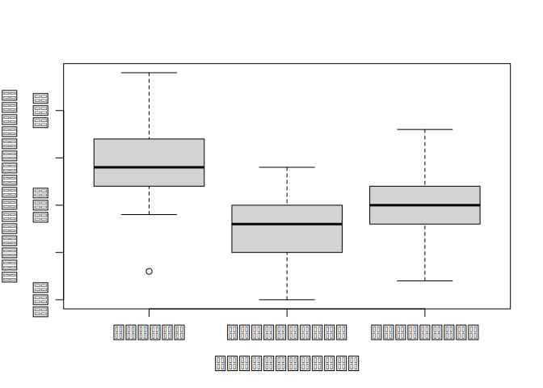
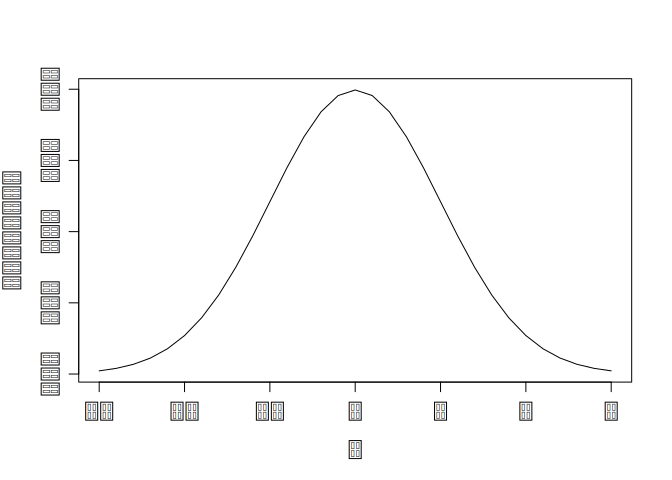
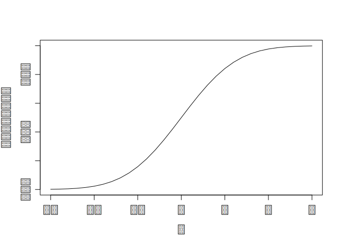

Karol Cieply lab4
================

## GitHub Documents

This is an R Markdown format used for publishing markdown documents to
GitHub. When you click the **Knit** button all R code chunks are run and
a markdown file (.md) suitable for publishing to GitHub is generated.

## Including Code

You can include R code in the document as follows:

``` r
summary(cars)
```

    ##      speed           dist       
    ##  Min.   : 4.0   Min.   :  2.00  
    ##  1st Qu.:12.0   1st Qu.: 26.00  
    ##  Median :15.0   Median : 36.00  
    ##  Mean   :15.4   Mean   : 42.98  
    ##  3rd Qu.:19.0   3rd Qu.: 56.00  
    ##  Max.   :25.0   Max.   :120.00

## Mean

$${\displaystyle A={\frac {1}{n}}\sum _{i=1}^{n}a_{i}={\frac {a_{1}+a_{2}+\cdots +a_{n}}{n}}}$$

``` r
mean((c(6,9,4,3,4,9,4,2,7,3,5,4,7,1,3,5,1,7,3,4,7,9,7,2,9,1,8,2,7,4)))
```

    ## [1] 4.9

## Variance

<br />
$$\sigma^2 = \frac{\displaystyle\sum_{i=1}^{n}(x_i - \mu)^2} {n}$$
$$\sigma^2 = \frac{\displaystyle\sum_{i=1}^{n}(x_i - \mu)^2} {n-1}$$

``` r
var(c(5,3,3,2,4,4,8,9,6,1,10,8,5,2,5,2,4,10,6,3,1,9,3,4,1,9,10,7,1,7))
```

    ## [1] 9.029885

## Mean price of diamonds based on color and cut

``` r
diamonds <- read.csv("diamondsCSV.csv")
diamondssum <- aggregate(diamonds$price, list(diamonds$cut), sum)
diamondsavg <- aggregate(diamonds$price, list(diamonds$cut), mean)
diamondsavgcolor <- aggregate(diamonds$price, list(diamonds$cut, diamonds$color), mean)
diamondsavgcolorre <- reshape(diamondsavgcolor, idvar = "Group.1", timevar = "Group.2", direction = "wide")
head(diamondsavgcolorre)
```

    ##     Group.1      x.D      x.E      x.F      x.G      x.H      x.I      x.J
    ## 1      Fair 4291.061 3682.312 3827.003 4239.255 5135.683 4685.446 4975.655
    ## 2      Good 3405.382 3423.644 3495.750 4123.482 4276.255 5078.533 4574.173
    ## 3     Ideal 2629.095 2597.550 3374.939 3720.706 3889.335 4451.970 4918.186
    ## 4   Premium 3631.293 3538.914 4324.890 4500.742 5216.707 5946.181 6294.592
    ## 5 Very Good 3470.467 3214.652 3778.820 3872.754 4535.390 5255.880 5103.513

## Explaining what is outlier

In statistics, an outlier is a data point that differs significantly
from other observations.

``` r
plot(iris$Sepal.Width ~ iris$Species)
```

<!-- -->

``` r
X <- seq(-3,3,by=0.2)


plot(X,dnorm(X),type="l")
```

<!-- -->

``` r
plot(X,pnorm(X),type="l")
```

<!-- -->
